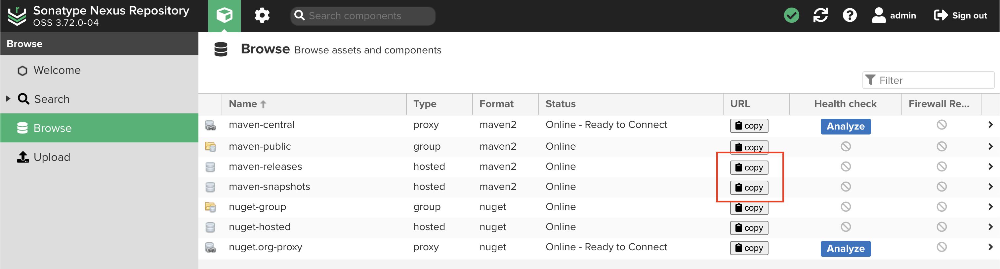

## Publish to repository

### Self managed Nexus3 repository



Copy the URL from maven-releases and maven-snapshots. These are the location
where we'll be publishing to.

#### build.gradle

```groovy
plugins {
    id 'maven-publish'
}

java {
    // build sources jar
    withSourcesJar()
    // build javadoc jar
    withJavadocJar()
}

publishing {
    publications {
        maven(MavenPublication) {
            // override the artifactId, gradle defaults to folder name.
            artifactId 'sohoffice-authorization-core'
            from components.java
            pom {
                name = 'sohoffice-authorization core Library'
                description = 'A Java library to authorize request by evaluating ABAC policy statements'

                licenses {
                    license {
                        name = 'The MIT License'
                        url = 'https://opensource.org/license/mit'
                    }
                }
                developers {
                    developer {
                        id = 'sohoffice'
                        name = 'Douglas Liu'
                        email = 'douglas@sohoffice.com'
                    }
                }
                scm {
                    connection = 'scm:git:git@github.com:sohoffice/sohoffice-authorization.git'
                    developerConnection = 'scm:git:git@github.com:sohoffice/sohoffice-authorization.git'
                    url = 'https://github.com/sohoffice/sohoffice-authorization'
                }
            }
        }
    }
    repositories {
        maven {
            // This is maven-releases URL
            def releasesRepoUrl = 'http://localhost:8081/repository/maven-releases/'
            // This is maven-snapshots URL
            def snapshotsRepoUrl = 'http://localhost:8081/repository/maven-snapshots/'
            // Use version name to determine which repository to publish to
            url = version.endsWith('SNAPSHOT') ? snapshotsRepoUrl : releasesRepoUrl
            // allow reading credentials from external location
            credentials(PasswordCredentials)
            // Allow http protocol to be used
            allowInsecureProtocol = true
        }
    }
}
```